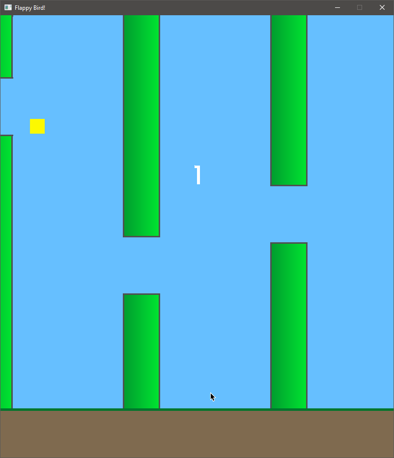

# flappy-go

If you want to see an AI play the game, check out [fr3fou/flappy-ai](https://github.com/fr3fou/flappy-ai)

## TODO

- [x] Fix bottom pipes not having colission
- [x] Ground Colission detection
- [x] Render pipes on demand / Delete not visible pipes
- [ ] Sprites for bird, pipes and ground
- [x] Scoring

## Resources

- <https://stackoverflow.com/questions/14011844/choosing-parents-to-crossover-in-genetic-algorithms>
